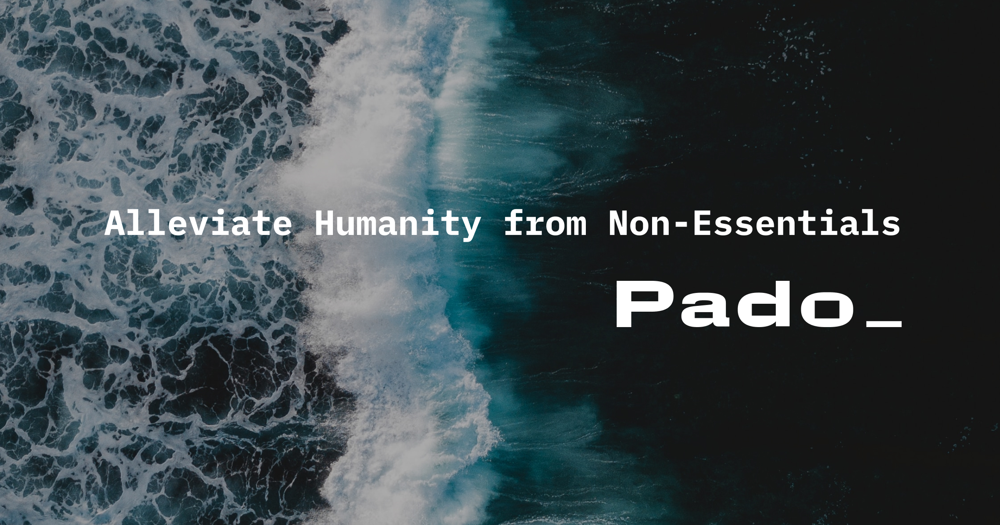

# Pado 🌊

A macOS always-on-top AI assistant that can interact with your applications.

## Concept

Pado is a pixelated wave that lives on your desktop and helps you accomplish tasks across your Mac applications. The character is a rasterized ocean wave - a nod to both the name (파도 = wave in Korean) and the retro-digital aesthetic. Think of it as a helpful companion that can:

- Read and analyze content from any open application
- Perform multi-step tasks across different apps
- Consolidate information into structured formats (Excel, etc.)
- Act as your personal assistant for repetitive workflows

## Example Use Cases

- **Email Processing**: "Read all applicant emails for the designer position and create an Excel summary"
- **Research**: "Gather information from these browser tabs and summarize the key points"
- **Data Entry**: "Take this PDF invoice and enter the details into my spreadsheet"
- **Organization**: "Sort my Downloads folder and move files to appropriate locations"

## Technical Architecture

### Core Components

1. **Always-On-Top Window**
   - Native macOS app using SwiftUI
   - Floating window with pixelated wave character
   - Draggable, resizable, minimal footprint
   - Wave animations (idle, thinking, working, complete)

2. **Application Access Layer**
   - macOS Accessibility APIs for reading screen content
   - AppleScript/JXA for application automation
   - Screen capture for visual understanding

3. **AI Backend**
   - Anthropic Claude API for reasoning and task planning
   - Computer Use capabilities for complex interactions
   - Local processing where possible for privacy

### Tech Stack

| Component | Technology |
|-----------|------------|
| Frontend | SwiftUI (native macOS) |
| AI Integration | Anthropic SDK |
| App Automation | Accessibility API, AppleScript |
| Data Processing | Swift + Python (for complex tasks) |

## Privacy & Security

- All processing happens locally when possible
- Explicit user permission required for each app access
- No data stored without consent
- Transparent about what the assistant can see/access

## Development Phases

### Phase 1: Foundation
- [ ] Basic always-on-top SwiftUI window
- [ ] Pixelated wave character with state animations
  - Idle: gentle wave motion
  - Thinking: ripple effect
  - Working: active wave crashing
  - Complete: calm settling
- [ ] Text input for commands
- [ ] Anthropic API integration

### Phase 2: Application Access
- [ ] Accessibility API integration
- [ ] Read content from focused application
- [ ] Basic AppleScript automation
- [ ] Permission management UI

### Phase 3: Task Execution
- [ ] Multi-step task planning
- [ ] Excel/CSV file generation
- [ ] Email reading and parsing
- [ ] Cross-application workflows

### Phase 4: Polish
- [ ] Wave personality expressions (color shifts, particle effects)
- [ ] Task history and favorites
- [ ] Settings and preferences
- [ ] Menu bar integration

## Design

### Character: The Wave

- **Base Shape**: Pixelated/rasterized wave (`assets/icon.svg`)
- **Color**: Deep blue `#0123B4`
- **Style**: Retro pixel art aesthetic
- **Animations**: State-based transformations of the wave form

### Potential Expressions

| State | Visual |
|-------|--------|
| Idle | Gentle up/down bob |
| Listening | Subtle pulse |
| Thinking | Ripple pattern |
| Working | Active wave motion |
| Success | Sparkle/glow effect |
| Error | Red tint, shake |

## Requirements

- macOS 13.0+ (Ventura or later)
- Accessibility permissions
- Anthropic API key

## Open Questions

1. **Interaction Model**: Voice input? Text only? Both?
2. **Scope of Access**: Which applications to prioritize? (Mail, Safari, Finder, Excel...)
3. **Offline Mode**: Limited functionality without internet?
4. **Size/Position**: Default size and screen position? Remembers last position?

---

*Pado (파도) means "wave" in Korean - a helpful wave that carries your tasks to completion.*
